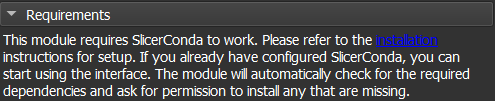

# Dental Oral and Craniofacial Shape Analysis eXplainability and Interpretability (DOC-ShapeAXI)

## Overview

"DOC-ShapeAXI" is an extension for 3D Slicer, a free, open-source software for medical, biomedical and related imaging research. This extension aims to provide a Graphical User Interface for a deep-learning classification tool developed at the University of North Carolina at Chapel Hill in collaboration with the University of Michigan at Ann Arbor. 

The extension integrates advanced deep learning algorithms enabling the classification of nasopharynx airways obstruction, mandibular condyles, and alveolar bone defect in cleft. The tool facilitates the automated classification of medical shapes, assisting in clinical diagnosis and decision-making.

## Key features
- **Deep-Learning Integration**: integrate [ShapeAXI](https://github.com/DCBIA-OrthoLab/ShapeAXI) for advanced deep-learning classification.
- **User-Friendly interface**: Easy-to-use interface tailored for clinicians with minimal technical background.
- **Automated Classification**: Efficiently processes input data and provides classification results.
- **Explainability**: Offers insights into model decision-making, enhancing transparency for clinical use. 

## Requirements

 - This extension works with Linux and Windows.
 - This extension requires the installation of SlicerConda. Follows the [instructions](https://github.com/DCBIA-OrthoLab/SlicerConda) for more information.

  > [!]
  > If the user is not sure if SlicerConda is already installed, the system will inform him, as shown below in the user interface
  > 

## Installation

 - You will find the module under the name  `DOCShapeAXI` in the `Automated Dental Tools` tab.

## Supported Dataset
Currently, the extension supports only three types of datasets:
- Nasopharynx Airway Obstruction: Three models are available for this dataset. 
  - **Severity model**: classifies 4 levels of airway obstruction ranging from 0 to 3, where 0 is the lowest level and 3 is the greatest level. 
  - **Binary model**: classifies between 0 and 1, where 0 is the absence and 1 is the presence of adenoid hypertrophy-related obstruction. 
  - **Regression model**: directly predicts the ratio of obstruction ranging between 0 and 100%.
- Mandibular Condyle: 
  - **Severity model**: classifies the condylar changes into 4 levels of severity ranging from 0 to 3.
- Alveolar Bone Defect in Cleft: 
  - **Severity model**: classifies the defect into 4 levels of severity ranging from 0 to 3.

## How does the module work?

 1. Select a **Data Type**: 
    - nasopharynx airways obstruction, mandibular condyles, and alveolar bone defect in cleft.
    - This step allow to select automatically the appropriate classification model.
 2. Select an **Input folder**: a folder that contains 3D models stored as VTK files.
 3. Select an **Output directory**: a folder that will contain all the outputs (model, predictions results stored in a CSV file, and explainability visualizations).

 4. Run the module: 
    - Click on the **Run Prediction** button. 
    - The progress will be display in the UI with a progress bar.

## Viewing the Results

All the results are saved in the **Output directory** specified by the user. you can find:
- the csv file containing the prediction made by the network.

- a folder named **Explainability** containing the visualization results:
  1. Open the folder and drag and drop a shape in Slicer
  2. Go to the module **Models**
      
  3. In the **Display** drop-down menu, click on the **Scalar** section
  4. check the **visibility** box and change the color table to **ColdToHotRainbow**
  5. Set the **Data Scalar Range** to **Auto** if not set
    
  6. Change the **Active Scalar** to the class you want to visualize
    

## Exemple (coming soon)

Below is a link to a youtube tutorial of how to use the tool.